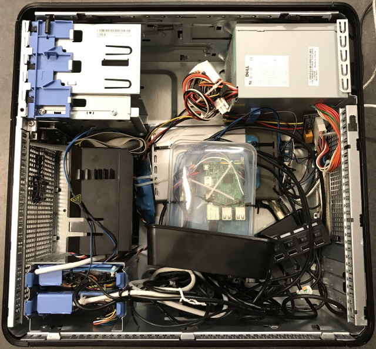
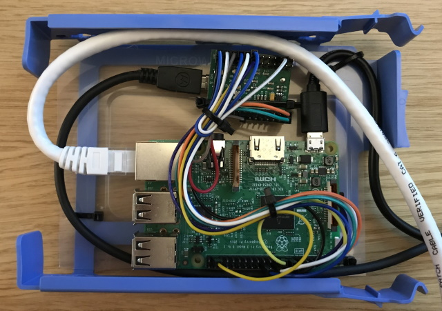
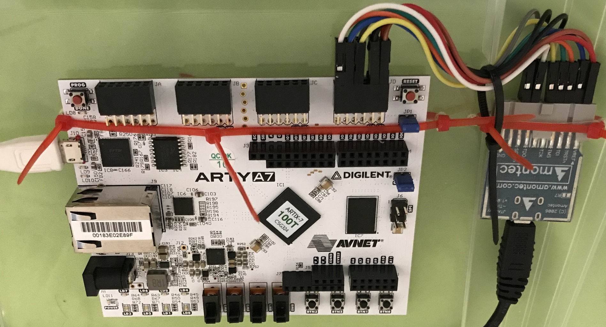

# The box


## Parts of a box
See the pictures in [`pictures/box`](pictures/box).

* Power supply
* Fan
* USB controller board (Arduino Nano)
* USB power outlets
* USB Hubs

## A RPi3 module


See the pictures in [`pictures/rpi`](pictures/rpi).

### Wiring a RPi with a Mini module
USB bus power (VBUS to VCC).
   * CN3-1 to CN3-3
   * Alternative: Self-powered
     * DON'T CONNECT CN3-1
     * CN3-2 to RPi pin 6 (GND)
     * CN3-3 to RPi pin 4 (5V)

IO and chip power (3.3V to VCCIO).
   * CN2-1 to CN2-11
   * CN2-3 to CN2-21 (not strictly required, but nice to have)
   * CN2-5 to CN3-12 (not strictly required, but nice to have)

GND/TX/RX to RPi.
   * RPi-GND: CN2-2  to 14
   * RPi-TX : CN3-25 to 8  (GPIO14/TXD0)
   * RPi-RX : CN3-26 to 10 (GPIO15/RXD0)

JTAG (Mini module to RPi)
   * RPi to RPi: `1 (V3V3)` to `15 (GPIO22/ARM_TRST)`
   * unconnected: `16 (GPIO23/ARM_RTCK)`
   * `CN2-9` to `18 (Gpio24/ARM_TDO)`
   * `CN2-7` to `22 (Gpio25/ARM_TCK)`
   * `CN2-10` to `37 (Gpio26/ARM_TDI)`
   * `CN2-12` to `13 (Gpio27/ARM_TMS)`

### Prepare SD card with latest firmware files (enables network boot on every RPi until "3+" and contains bugfixes)
From `{EMBEXP-BOX}/tools/firmware/boot_{thelatest}`, take the file `bootcode.bin` and copy it on an empty FAT32 formatted SD card.

### Flash EEPROM of RPi 4 and configure it to enable network boot
TODO: add configured EEPROM image in tools/firmware/custom/rpi4_eeprom/...
TODO: clean up the following notes
1. Standard EEPROM update
   ```
   sudo apt update
   sudo apt full-upgrade
   sudo apt install rpi-eeprom

   sudo apt update
   sudo apt upgrade
   sudo apt install rpi-eeprom

   sudo rpi-update

   # Enable beta releases in the standard update process
   sudo echo FIRMWARE_RELEASE_STATUS="beta" > /etc/default/rpi-eeprom-update

   sudo systemctl mask rpi-eeprom-update
   ```
1. Configure EEPROM
   ```
   cp /lib/firmware/raspberrypi/bootloader/beta/pieeprom-2019-10-16.bin pieeprom.bin
   rpi-eeprom-config pieeprom.bin > bootconf.txt

   nano bootconf.txt
   ############
   BOOT_UART=1
   BOOT_ORDER=0x21
   #probably not needed:
   TFTP_PREFIX=0
   ############

   rpi-eeprom-config --out pieeprom-netboot.bin --config bootconf.txt pieeprom.bin

   sudo rpi-eeprom-update -d -f ./pieeprom-netboot.bin
   sudo reboot

   vcgencmd bootloader_config
   vcgencmd bootloader_version
   ```

### Cabling of a RPi module
* Power - micro USB
* Reset - jumper cable gnd and rst, rst with resistor in series (3,9 k ohm)
* UART/JTAG - mini USB
* Ethernet - patch cable


## An LPC11C24 board (LPCXpresso with CMSIS DAP)
The board does not connect to the serial port of the processor by default. One has to either connect it with an external module or connect it using small resistors on the board. For the latter option, see the pictures in [`pictures/lpc11c24`](pictures/lpc11c24).


## An Arty-A7 board


### Writing the flash memory without Vivado
This is not strictly needed at the moment, but it can be useful for later.
```
# note: it takes about 3 minutes to write and then 2 minutes to verify
interface/fpgaprog.py box3 arty_a7_100t_0 arty_a7_100t_riscv_freedom_e300/E300ArtyDevKitFPGAChip --to_flash
```

### Cabling of an Arty-A7 board
* Power/FPGA-JTAG/UART - micro USB
* JTAG - mini USB (JTAG wiring, see `https://www.digikey.com/eewiki/display/LOGIC/Digilent+Arty+A7+with+Xilinx+Artix-7+Implementing+SiFive+FE310+RISC-V`)

